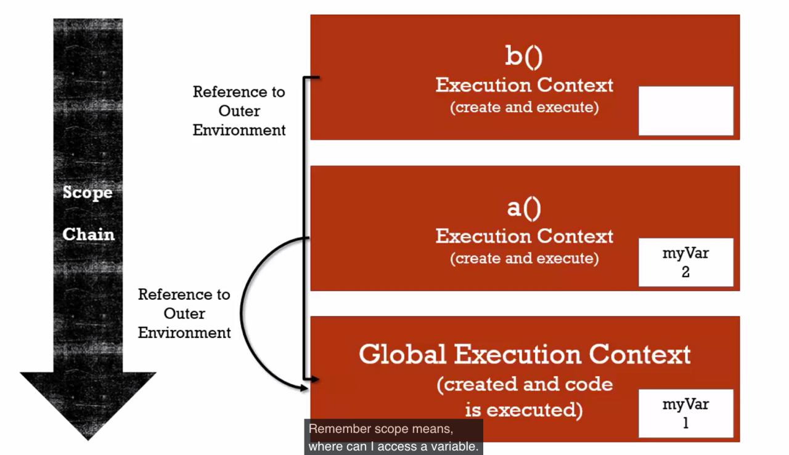
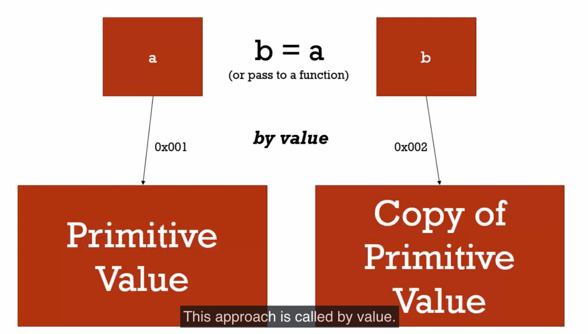
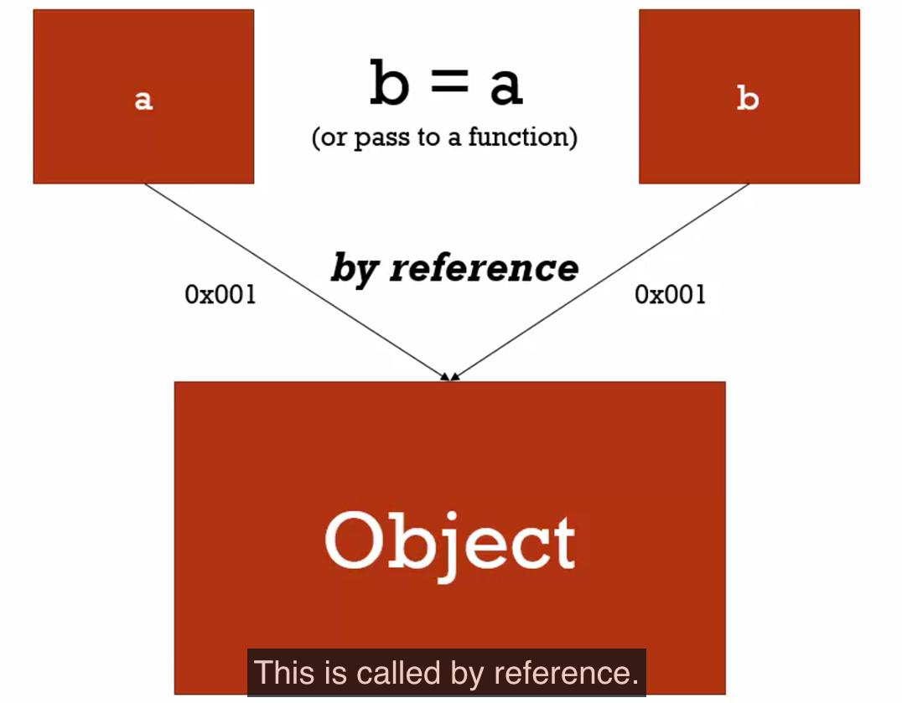

# Теория JavaScript

## Syntax parser (Синтаксический анализатор)

**Syntax parser - a program that reads your code and determines what it does and if its grammar is valid**

*Синтаксический анализатор - это программа, которая читает ваш код и определяет что он делает и верен ли грамматически*

---

## Lexical environment (Лексическое окружение)

**Lexical environment - where somethings sits physically in the code you write**

*Лексическое окружение - где именно что-то находится физически в коде, который вы написали
(то есть важность физического нахождения чего-либо в вашем коде)*

---

## Execution context (Контекст исполнения(выполнения))

**Execution context - a wrapper to help manage the code that is running**

*Контекст исполнения - обертка, которая помогает управлять запущенным кодом*

---

## Global execution Context (Глобальный контекст исполнения)

*Контекст который виден в любом месте в вашем коде (срабатывает всегда)
Он создает Global Object (который создает специальную переменную называемую this)  
Global in JavaScript means not inside a function (В JS глабольно значит не внутри функции)*

---

## Name/value pair (Пара значений/имен)

**name/value pair - a name which maps to a unique value**

*пара значений/имен - имена, которые соответсвует уникальным значениям*

*The name may me be defined more than once, but only can have one value in any given context*

*(имя может быть определено больше одного раза, но может иметь только одно значение в любом заданном контексте)*

Example:

`Address = ‘100 Main St.’`  -  Name / Value

---

## Object (Объект)

**Object - a collection of name value pairs**

*Объект - коллекция пар значений/имен*

---

## Single threaded (Однопоточный)

**Single threaded - one command at a time
under the hood of the browser, maybe not**

*Однопотончый - одна команда выполняется за раз
под капотом браузера, может быть нет*

---

## Synchronous execution (Синхронное выполнение)

**Synchronous - one at a time, and in order…**

*Synchronous - один за раз и по порядку*

---

## Asynchronous (Асинхронность)

**More than one at a time**

*Больше чем один за раз*

---

## Invocation (Вызов функции)

**Invocation - running a function**

**In Javascript, by using parenthesis()**

*Вызов - запуск функции*

*В JS это делается с использованием простых скобок ()*

---

## Variable environment (Окружение переменных)

**Where the variables live
and how they relate to each other in memory**

*Где переменные живут и как они относятся друг к другу в памяти (В каждом Execution Context свой собственный Variable environment)*

---

## Scope (Область видимости)

**Where a variable is available in your code
And if it’s truly the same variable, or a new copy**

*Область видимости - где переменная доступна в вашем коде*

---

## The Scope Chain (Цепь областей видимости)

**Scope means, where can i access a variable.**

*Когда мы запрашиваем переменную или пытаемся с ней что-то сделать, JS делает больше чем просто ищет ее в
Окружении переменных в текущем Executing context. Если он не находит в текущем Executing context,
то начинает искать в Outer Reference (который зависит от Lexical Environment
физическом нахождении данной функции в теле кода)*

---

## Block Scoping (Область блока)

*Все что находится внутри блока - {}*

---

## Dynamic Typing (Динамическая типизация)

**You don’t tell the engine what type of data a variable hold, it figures it out while your code is running
Variables can hold different types of values because it’s all figured out during execution.**

*Вы не указываете движку, какой тип данных хранится в переменной, он выясняет это во время работы вашего кода.
Переменные могут содержать различные типы значений, потому что все это выясняется во время выполнения.*

---

## Primitive type (Примитивный тип данных)

**A type of data that represents a single value that’s not an object.**

*Тип данных, представляющих одно значение. Это данные, которые не являются объектом и не имеют методов.
В JavaScript 6 простых типов данных: string, number, boolean, null, undefined, symbol (новое в ECMAScript 2015).*

---

## Operators (операторы)

**A special function that is syntactically (written) differently than regular functions are written in your code
Generally, operators take two parameters and return one result**

*Специальная функция, которая синтаксически (написана) отличается от обычных функций написаных в вашем коде.
Обычно операторы принимают два параметра и возвращают один результат*

---

## Operator precedence (Приоритет операторов)

**Which operator function gets called first.
Functions are called in order of precedence (HIGHER precedence wins)**

*Какая операторская функция вызывается первой.
Функции вызываются в порядке приоритета (выигрывает ВЫСШИЙ приоритет)*

---

## Associativity (Порядок выполнения)

**What order operator functions get called in: left-to-right or right-to-left.
When functions have the same precedence**

*В каком порядке вызываются операторные функции: слева направо или справа налево.
Когда функции имеют одинаковый приоритет*

---

## Coercion (Принуждение)

**Converting a value from one type to another
This happens quite often in Javascript because it’s dynamically typed.**

*Конвертирование значений из одного типа в другой.
Это случается довольно часто в JS, потому что он динамически типизированный.*

---

## Mutate (Изменять)

**To change something (изменять что-либо)
immutable means can’t be changed.**

*‘’Immutable’’ значит не может быть изменен*

--- 

## Object Literal (Литерал объекта) - is {},  that’s the same as ‘new Object()’.

---

## Namespace (Пространство имен)

**A container for variables and functions
Typically to keep variables and functions with the same name separate.**

*Контейнер для переменных и функций
Обычно для хранения переменных и функций с одинаковыми именами.*

---

## JSON (JavaScript Object Notation) JavaScript Обозначение объекта

**JSON is inspired by the object literal notation in JS**

---

## First class functions (Функции первого класса)

**Everything you can do with other types you can do with functions.
Assign them to variables, pass them around as parameters to other functions, create them on the fly.**

*Все, что вы можете делать с другими типами, вы можете делать с функциями. Назначать их переменным, передавать их
как параметры в другие функции, создавать их на лету.*

---

## Expression (Выражение)

**A unit of code that results in a value
it doesn’t have to save to a variable**

*Единица кода, которая приводит к значению. Не нужно сохранять в переменную.
Выражение - это все то что возвращает значение*

---

## by value (по значению)

## by reference (по ссылке)

---

## Arguments

**the parameters you pass to a function**

*Javascript gives you a keyword of the same name which contains them all*

---

## Whitespace

**invisible characters that create literal ‘space’ in your written code**

*Carriage return, tabs, spaces.*

---

## Callback function

**A function you give to another function, to be run when the other function is finished**

*So the function you call (i.e invoke), ‘calls back’ by calling the function you gave it when it finishes*

---

## Function currying

**Creating a copy of  a function but with some preset parameters**

*Создание копии функции, но с некоторыми предустановленными параметрами*

*Very useful in mathematical situations.*

---

## Inheritance (Наследование)

**One object gets access to the properties and methods of another object.**
